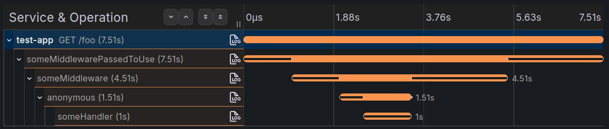

# hono-middleware-tracer

> OpenTelemetry instrumentation that generates spans for every Hono middleware and handler.

[](https://www.npmjs.com/package/hono-middleware-tracer)
[](https://opentelemetry.io/)
[](https://hono.dev/)

---

## Overview

`hono-middleware-tracer` wraps every middleware and handler in your Hono app with an OpenTelemetry span, giving you granular visibility into where time is spent across your request lifecycle.

> [!IMPORTANT]
> This library requires [`@hono/otel`](https://github.com/honojs/middleware/tree/main/packages/otel). Without it, no spans will be produced — the library expects a parent trace that `@hono/otel` provides.

---

## Generated traces

A span is created for every middleware or handler (supports the `.get`, `.post`, `.patch`, `.put`, `.delete`, `.use`, and `onError`). Given a server like this:

```ts
import { httpInstrumentationMiddleware } from "@hono/otel";
import { Hono } from "hono";

function sleep(ms: number) {
  return new Promise<void>((resolve) => setTimeout(resolve, ms));
}

const app = new Hono();
app.use(httpInstrumentationMiddleware());

app.use(async function someMiddlewarePassedToUse(_c, next) {
  await sleep(1000);
  const resp = await next();
  await sleep(2000);
  return resp;
});

app.get(
  "/foo",
  async function someMiddleware(_c, next) {
    await sleep(1000);
    const resp = await next();
    await sleep(2000);
    return resp;
  },
  // This will be traced as "anonymous"
  async (_c, next) => {
    await sleep(500);
    return next();
  },
  async function someHandler(c) {
    await sleep(1000);
    return c.json("bar", 200);
  },
);
```

The resulting trace looks like this (visualized with [Grafana Tempo](https://grafana.com/docs/tempo/latest)):



### `onError` support

The Hono `onError` handler is also instrumented, with a fallback span name of `errorHandler`.

### Span attributes

| Attribute | Description |
|-----------|-------------|
| `hono.middleware.duration_millis.pre` | Time in ms the handler/middleware spent **before** calling `next` |
| `hono.middleware.duration_millis.post` | Time in ms spent **after** calling `next`. This is `0` for handlers that returned or threw without calling `next` |

---

## Usage

### Manual instrumentation

```ts
import { HonoMiddlewareTracer } from "hono-middleware-tracer";
import { NodeSDK } from "@opentelemetry/sdk-node";

const sdk = new NodeSDK({
  // ...
  instrumentations: [
    // ...
    new HonoMiddlewareTracer({ /* options */ }),
  ],
});

sdk.start();
```

### No-code instrumentation

Recommended when using [OTEL zero-code instrumentation](https://opentelemetry.io/docs/zero-code/js/). Preload the `hono-middleware-tracer/register` script with `--require` or `--import`:

```bash
node \
  --require @opentelemetry/auto-instrumentations-node/register \
  --require hono-middleware-tracer/register \
  ./dist/index.js
```

> Works with `tsx` as well:
> ```bash
> tsx \
>   --require @opentelemetry/auto-instrumentations-node/register \
>   --require hono-middleware-tracer/register \
>   ./src/index.ts
> ```

---

## Config

### `fallbackSpanName`

**Type:** `string` | **Default:** `"anonymous"`

The span name used when a middleware function has no name (i.e. anonymous arrow functions). Named functions use their function name automatically.

```ts
new HonoMiddlewareTracer({
  fallbackSpanName: "unnamed",
})
```

---

## Roadmap

- [ ] Support `@hono/zod-openapi`
- [ ] Support `hono/factory`